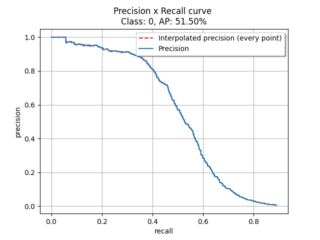

# Steps to obtaining optimal score thresholds for each class

This script PascalVOC mAP evaluation and additionally, outputs optimal score thresholds for each class based on maximizing F1 score.

## 1. Obtain detections from RT-DETR
```
repos/RT-DETR/rtdetrv2_pytorch/

CUDA_VISIBLE_DEVICES=0 torchrun --master_port=9909 --nproc_per_node=1 tools/train.py -c configs/rtdetrv2/rtdetrv2_r101vd_6x_coco_eval_aerovect.yml -r checkpoints/rtdetrv2_r101vd_6x_coco_from_paddle.pth --test-only
```

This will output the following files under `repos/RT-DETR/rtdetrv2_pytorch/output/aerovect`:
1. `labels_map.json`: This contains the taxonomy mapping used during the evaluation
1. `image_ids.txt`: This contains the ids of images used during the evaluation, these ids will be used to retrieve the image paths in the `predictions.txt` file
1. `predictions.txt`: This contains the predicted bounding boxes for each image. Predictions for each image are separated by `---` .

## 2. Prepare detections and groundtruths into expected input format
1. Modify paths in `aerovect_prepare.py`
2. Run preparation script
  ```
  cd repos/Object-Detection-Metrics

  python3 aerovect_prepare.py
  ```

## 3. Evaluate
```
python3 aerovect_eval.py -t 0.5 -gtformat xywh -detformat xywh -gtcoords abs -detcoords abs
```
Example output:
```
IoU threshold=0.5
Class 0 - score: 0.46, f1: 0.56, AP: 0.52
Class 2 - score: 0.91, f1: 0.36, AP: 0.30
Class 4 - score: 0.50, f1: 0.62, AP: 0.55
Class 7 - score: 0.28, f1: 0.48, AP: 0.44
mAP: 0.45
```
P-R curves for each class are saved to `Object-Detection-Metrics/results`. Example:



